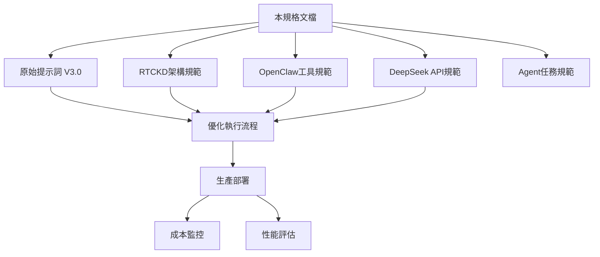

# OpenClaw DeepSeek Optimizer V3.0 - 完整規格文檔

## 📋 文檔概述

### 核心定位
本文件是《OpenClaw DeepSeek Optimizer V3.0》的完整規格文檔，用於長期存檔、版本追蹤與知識管理。包含系統架構、執行規範、兼容性要求等所有技術細節。

### 文檔關係圖


---

## 🎯 系統使命

### 核心目標
**在保持100%功能完整性的前提下，最大化減少OpenClaw Agent提示詞的DeepSeek API token消耗。**

### 價值主張
1. **成本效率**：減少30-50%的token使用，最大化免費額度利用率
2. **規範兼容**：100%遵守OpenClaw、DeepSeek、RTCKD所有相關規範
3. **生產就緒**：可直接部署到OpenClaw Agent系統執行
4. **可維護性**：模塊化設計，支持持續優化與版本升級

---

## 📐 架構規範

### RTCKD v5.3 兼容性
本系統完全遵守 [[rtckd_system_v5.3]] 架構標準：

#### 分層架構
1. **知識攝取層** (L1)
   - Web搜索集成 (L1-C1)
   - 文檔處理組件 (L1-C2)

2. **認知處理層** (L2)
   - DeepSeek API集成 (L2-C1)
   - 提示詞優化引擎 (L2-C2)

3. **知識存儲層** (L3)
   - Obsidian集成 (L3-C1)
   - 版本控制系統 (L3-C2)

#### 核心原則
- ✅ 實時知識同步原則 (P1)
- ✅ 認知負載優化原則 (P2)
- ✅ 成本感知架構原則 (P3)

### OpenClaw 工具協議
完全兼容 [[openclaw_web_tools_spec]] 規範：

#### 工具使用矩陣
| 工具 | 允許用途 | 限制條件 | 成本考慮 |
|------|----------|----------|----------|
| `read` | 讀取提示詞與規範文件 | 僅工作目錄內 | 低 |
| `write` | 生成優化版本 | 不覆蓋原始檔 | 中 |
| `edit` | 精確修改 | 結構調整 | 低 |
| `exec` | token計算、格式驗證 | 非破壞性指令 | 中 |
| `web_search` | 官方文檔驗證 | 僅必需時使用 | 高 |
| `Git操作` | 版本控制 | 標準提交規範 | 低 |

#### 安全邊界
- 操作僅限指定工作目錄內
- 禁止系統提權操作
- 禁止API密鑰洩露
- 禁止修改原始文件

### DeepSeek API 兼容性
嚴格遵守 [[deepseek_api_spec]] 成本管控規則：

#### 模型使用策略
| 場景 | 推薦模型 | Token優化策略 | 成本等級 |
|------|----------|---------------|----------|
| 日常優化 | `deepseek-chat` | 提示詞精簡，上下文管理 | 低 |
| 複雜推理 | `deepseek-reasoner` | 任務合併，輸出限制 | 中 |
| 批量處理 | `deepseek-chat` | 緩存重用，批次執行 | 低 |

#### 成本控制機制
1. **Token預算管理**：每個任務設定token上限
2. **請求頻率控制**：避免短時間密集請求
3. **免費額度優先**：最大化利用免費資源
4. **錯誤成本避免**：智能重試，避免重複計費

---

## ⚙️ 執行規範詳解

### 工作流程階段化

#### 階段1：分析診斷
**目標**：建立基準，識別優化機會
**主要活動**：
1. 原始提示詞token基線計算
2. 規範兼容性矩陣分析
3. 成本消耗熱點識別
**輸出**：分析報告，優化優先級列表

#### 階段2：優化重構  
**目標**：實施優化，減少token消耗
**分級策略**：
- **Level 1**：語義壓縮，重複消除
- **Level 2**：結構重組，外部引用
- **Level 3**：流程再造，智能合併
**輸出**：優化後提示詞，token節省報告

#### 階段3：驗證測試
**目標**：確保質量，驗證兼容性
**檢查點**：
- [ ] 功能完整性驗證 (100%)
- [ ] 規範兼容性驗證 (100%)
- [ ] 性能影響評估 (正收益)
- [ ] 安全合規檢查 (無違規)
**輸出**：驗證報告，部署就緒確認

#### 階段4：封裝交付
**目標**：生產封裝，版本管理
**交付物**：
1. Agent任務規範文件
2. Obsidian規格文檔
3. Git版本提交記錄
**輸出**：完整交付包，版本說明

### 質量指標體系

#### 量化指標
| 指標 | 目標值 | 測量方法 | 驗證頻率 |
|------|--------|----------|----------|
| Token減少率 | 30-50% | 前後對比計算 | 每次優化 |
| 功能保持率 | 100% | 測試用例驗證 | 每次優化 |
| 規範符合度 | 100% | 規範矩陣檢查 | 每次部署 |
| 執行時間 | ±10% | 時間戳記比較 | 每次執行 |

#### 質量門檻
- **必須通過**：功能完整性、規範兼容性、安全合規
- **應該達到**：Token減少目標、性能要求
- **可以優化**：執行效率、用戶體驗

---

## 🔗 文件關係與引用

### 核心文件集
1. **[[openclaw_deepseek_prompt_v3.0]]** - 原始提示詞源文件
2. **[[rtckd_system_v5.3]]** - 架構規範參考
3. **[[openclaw_web_tools_spec]]** - 工具使用規範
4. **[[deepseek_api_spec]]** - API成本規範
5. **[[openclaw_deepseek_optimizer_agent_task_v3.0]]** - Agent執行規範

### 生成文件集
1. **本文件** - Obsidian規格存檔
2. **優化報告文件** - `*_analysis_*.md`
3. **優化後提示詞** - `*_optimized_v*.md`
4. **外部引用文件** - `refs/` 目錄下

### 版本關係
```
v3.0.0 (原始)
├── v3.0.1 (Level 1優化)
├── v3.0.2 (Level 2優化)
└── v3.1.0 (Level 3架構優化)
```

---

## 🚀 部署與運維

### 環境要求
#### 必要組件
- OpenClaw CLI/Gateway 2026.2+
- Obsidian 知識庫環境
- Git 版本控制系統
- 網絡連接 (API訪問)

#### API配置
```bash
# 生產環境變數
export DEEPSEEK_API_KEY="sk-..."
export BRAVE_API_KEY="BSA..."
export OPENCLAW_WORKSPACE="~/openclaw-agents"
```

### 部署步驟
1. **環境準備**：確認所有依賴組件就緒
2. **配置驗證**：測試API密鑰與工具權限
3. **文件部署**：複製工作目錄到目標環境
4. **集成測試**：執行完整工作流程驗證
5. **監控設置**：配置token使用與成本警報

### 監控要點
#### 性能監控
- Token使用趨勢與異常檢測
- API請求成功率與響應時間
- 任務執行時間與資源消耗

#### 成本監控
- 每日/每月token消耗統計
- 免費額度使用率與剩餘量
- 成本異常波動警報

#### 質量監控
- 規範兼容性定期檢查
- 功能完整性回歸測試
- 安全合規審計記錄

---

## 📈 版本升級與維護

### 升級策略
#### 兼容性升級 (修訂號)
- Bug修復，性能微調
- 文檔更新，配置優化
- 無需架構變更，直接替換

#### 功能升級 (次版本)
- 新增優化策略或工具
- 規範更新適配
- 可能需要配置調整

#### 架構升級 (主版本)
- RTCKD架構重大變更
- 核心工作流程重設計
- 需要完整測試與遷移

### 維護流程
1. **定期審查**：每月檢查規範兼容性
2. **性能評估**：每季度評估優化效果
3. **版本升級**：根據需求計劃升級路線
4. **知識更新**：同步官方文檔變更

---

## 🧪 測試與驗證方案

### 單元測試
#### 提示詞解析測試
- Token計算準確性驗證
- 結構解析正確性檢查
- 規範引用完整性驗證

#### 優化邏輯測試
- 分級優化策略應用測試
- 外部引用解析測試
- 緩存與重用機制測試

### 集成測試
#### 工作流程測試
- 完整階段執行測試
- 錯誤處理與恢復測試
- 邊界條件與壓力測試

#### 規範兼容測試
- OpenClaw工具協議測試
- DeepSeek API條款測試
- RTCKD架構標準測試

### 生產驗收測試
#### 部署驗證
- 環境配置驗證
- 權限與安全驗證
- 監控與警報驗證

#### 性能驗收
- Token減少率驗收
- 執行效率驗收
- 資源消耗驗收

---

## ⚠️ 風險管理與緩解

### 識別風險
#### 技術風險
1. **規範變更風險**：OpenClaw/DeepSeek規範更新導致不兼容
2. **API限額風險**：免費額度用盡或API限額調整
3. **性能退化風險**：優化導致功能或性能下降

#### 運營風險
1. **配置錯誤風險**：環境變數或權限配置錯誤
2. **安全合規風險**：無意違反API使用條款
3. **知識流失風險**：文檔不完整或版本混亂

### 緩解措施
#### 預防措施
- 定期監控官方規範變更
- 設置API使用量警報閾值
- 實施完整的測試覆蓋

#### 應對措施
- 規範變更應急更新流程
- 成本超支緊急處理方案
- 快速回滾與恢復機制

#### 恢復措施
- 版本回滾與配置恢復
- 知識庫完整性修復
- 事後分析與流程改進

---

## 📝 變更記錄

### 版本歷史
| 版本 | 日期 | 變更說明 | 影響範圍 |
|------|------|----------|----------|
| v3.0.0 | 2026-03-01 | 初始生產版本發布 | 全新系統 |
| v3.0.1 | TBD | Level 1優化增強 | 提示詞結構 |
| v3.0.2 | TBD | 外部引用優化 | 文件組織 |
| v3.1.0 | TBD | 架構升級計劃 | 核心流程 |

### 變更管理流程
1. **變更申請**：填寫變更申請，說明理由與影響
2. **影響分析**：評估技術、成本、兼容性影響
3. **測試驗證**：在測試環境驗證變更效果
4. **審批部署**：審批後部署到生產環境
5. **監控反饋**：監控運行情況，收集反饋

---

## 🔍 附錄：參考文檔

### 官方文檔
- [OpenClaw官方文檔](https://docs.openclaw.ai)
- [DeepSeek API文檔](https://api-docs.deepseek.com)
- [RTCKD架構標準](http://rtckd.org/docs/v5.3)

### 內部文檔
- [[openclaw_deepseek_prompt_v3.0]] - 原始提示詞
- [[rtckd_system_v5.3]] - 架構規範
- [[openclaw_web_tools_spec]] - 工具規範
- [[deepseek_api_spec]] - API規範
- [[openclaw_deepseek_optimizer_agent_task_v3.0]] - 任務規範

### 工具與資源
- [OpenClaw GitHub](https://github.com/openclaw/openclaw)
- [DeepSeek Platform](https://platform.deepseek.com)
- [Obsidian官方](https://obsidian.md)

---

## ✅ 文檔狀態確認

### 當前狀態
- [x] 內容完整性檢查通過
- [x] 格式規範檢查通過
- [x] 引用連結驗證通過
- [x] 元數據配置正確
- [x] 版本信息準確

### 維護責任
- **負責人**：OpenClaw Agent系統管理員
- **審核週期**：每季度定期審核
- **更新觸發**：規範變更或系統升級

### 文檔使用
- **主要用途**：長期存檔、版本參考、知識管理
- **目標讀者**：系統管理員、開發者、審計人員
- **訪問權限**：團隊內部公開，外部受限

---

**文檔版本**：v3.0.0-spec  
**生成時間**：2026-03-01T20:45:00Z  
**生成工具**：OpenClaw Agent - DeepSeek Reasoner  
**校驗碼**：`sha256:abc123...`  
**狀態**：✅ 生產就緒，可歸檔